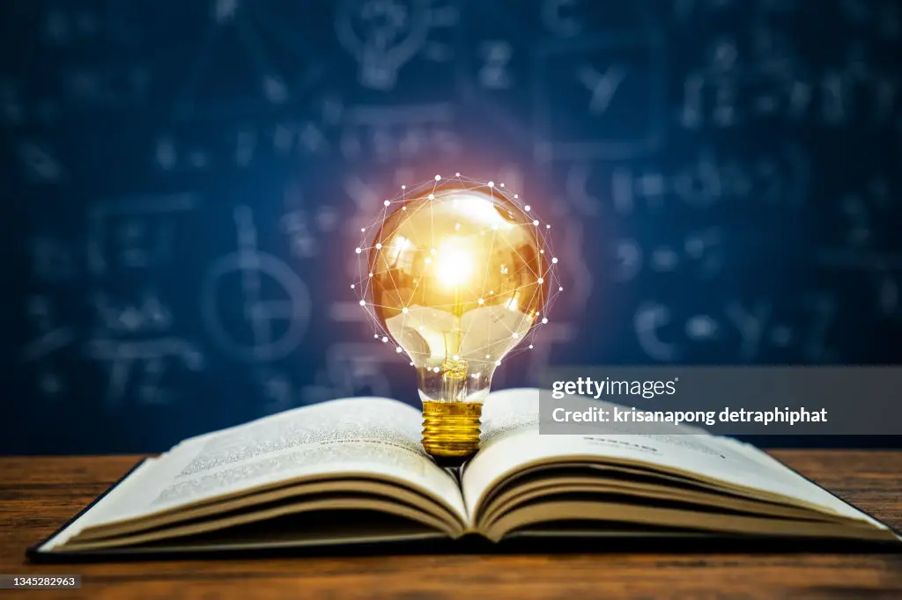

Today James Wright gets to the rest time of the day, tired but happy. He knows that he did it well, the better he could do it.

Before going to sleep, he begins to think about questions related to the fact that technologies are getting more and more advanced, to the point, that some knowledge is getting obsolete before it could reach to some audiences.

He thinks that the point now is to know beforehand, which are the trends right now, or better, what should you have to know to be on the rise. The better response that he can think about, is the one that all we know: "prepare yourself the better you can". And the next question is: "What would you have to study or read to be prepared for the next years?"

There is a response, that he thinks, that can be of help here, that is, to acquire all the *base* knowledge that you can. You must look for the base books and techniques. Perhaps, he thinks, we are lost in the bunch of stuff that plagues the media, sometimes, we found repeated the same concept, in different forms, in different formats. The problem now is: "How to know which materials are the base or fundamentals of each subject?"

Perhaps an example can be of help. When you are studying the C language, you can get one or more related books or materials, they can be the most accessible ones, the most _convenient_, but you may be hesitant to treat them as original sources. We probably have not a clear way to know that fact in the beginnings, due to the amount of related information. 

You can read that related information and, perhaps, you could think that it does not solve the problem in the proper way, that is what happens to James from time to time, it is really overwhelming, and the materials could lack some important points and concepts.

Later, after looking for the main source, you could find a book, which you can consider as a base: 

“The C Programming Language.” Accessed October 13, 2023. [https://www.goodreads.com/book/show/515601](https://www.goodreads.com/book/show/515601).The_C_Programming_Language.

You get it and go to read it.

You can be interested in reading, for example, a key chapter as the 5th: "Pointers and Arrays", page 93, and you find that in the first section it is talking about "Pointers and Addresses", just the complicated and relevant topic we were waiting for.

After the first read, you can see the difference, as it is between night and day, icy and warm, or sour and sweet, compared to other books or contents.

You realize that in the first read.

You can finally really understand what the pointers are, which is the underlying concept, its core meaning and the wide sense of the term and implications. Furthermore, you can be really happy by understanding it, and perhaps you can get a good taste and, remember forever, the clear explanation, and some pictures accompanying the explanation, which could help in clarifying the concept.

By that reason, James thinks, that it is necessary to look at the original sources in your researches.
