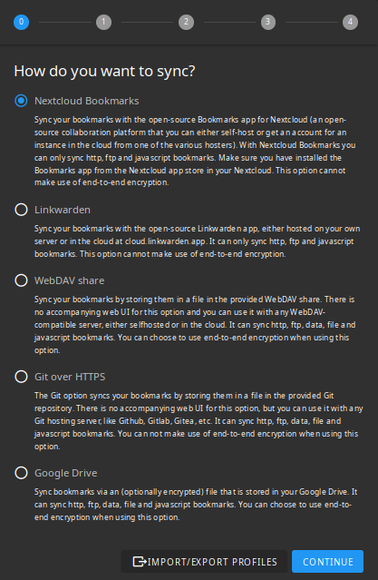

## Apps

Some apps I like:

### Visual Studio Code

https://code.visualstudio.com/

A good choice for generating code, using git and editing markdown files.

It is good too for managing and generating code in Python, Java, Go, JavaScript, HTML and other web languages.

It has many integrations and allows working remotely using "Remotes", including working inside containers as pre-built development environments.

### Floccus

https://floccus.org/

It is a browser bookmark manager.

The resulting bookmarks can be copied to other locations, and use that technique for syncronizing between browsers from different organizations.

Easy and trivial for installing and using it.

It has the lower possible dependencies. For storing bookmarks locally, you only have to install it, and that is it, but if you install and do not use more than that, you are not getting the full power.

After storing the bookmarks using floccus, you have the chance, using app menus, of storing those bookmarks in many places, for bakcup or syncronization purposes.

It is installable in browsers as (202505161246):

- Firefox
- Edge
- Chrome
- Android
- iOS
- Sources (you cant get them for customization)

It supports syncronization (20250517) with:

- Nextcloud Bookmarks
- LinkWarden
- WebDAV share
- Git over HTTPS (for any git repository as local git, GitHub, Gitea, GitLab, and others)
- Google Drive

